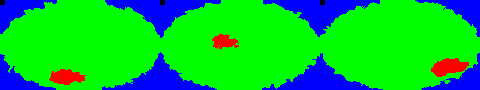
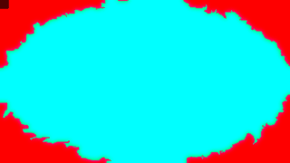
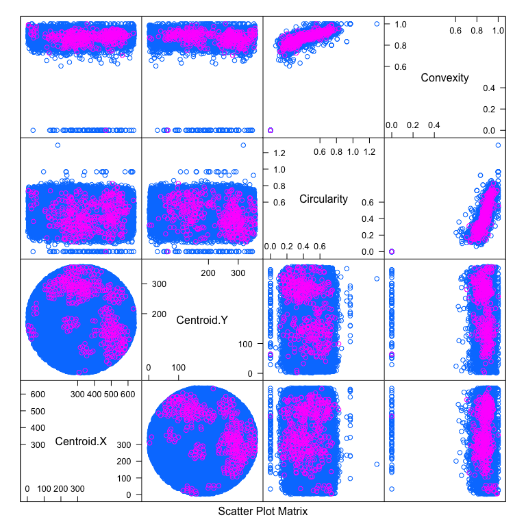
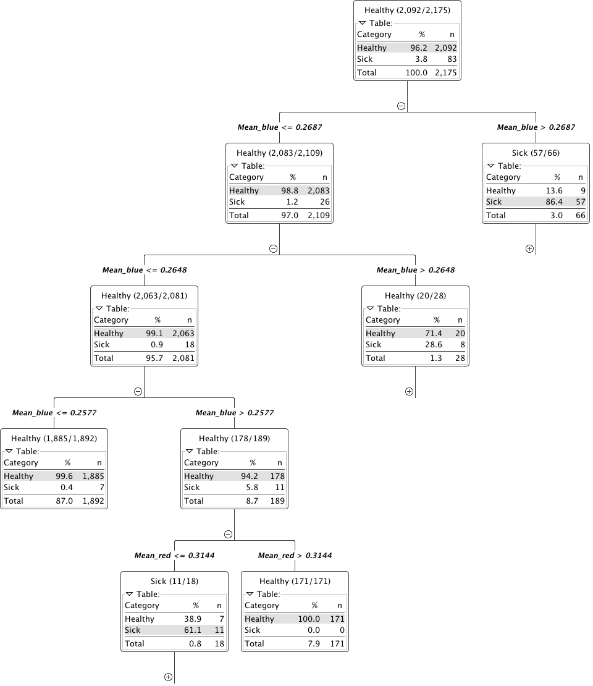
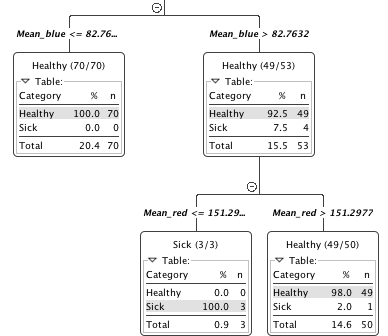

---

title: 'Capsule Endoscopy Video Analytics'

---

# Capsule Endoscopy Video Analytics

July 24, 2015

## Identifying Diseased Tissue in Capsule Endoscopy Movies

Capsule endoscopy is a particularly innovative way for diagnosing a number of conditions without requiring surgical or otherwise invasive procedures. The self-contained capsule is simple swallowed and videos are recorded of the patients digestive track. The usual passing time of 24-48 hours means that a significant amount of video data is created for each patient and much of it is not diagnostically relevant. Viewing and finding the ‘needles’ in this haystack of data is very time consuming and can cause many minor details to be missed.

## Image Query and Analysis Engine

The input videos can be 24 hours or longer so for this example we just show a small section of the video below and the steps for quantitative image analysis (taken from [https://www.youtube.com/watch?v=zBYbFQzldtU](https://www.youtube.com/watch?v=zBYbFQzldtU)).

### Sifting through old data

### Filter out samples with unique features

  
  

### Real-time Processing

  
  
  

### How?

The first question is how the data can be processed. The basic work is done by a simple workflow on top of our Spark Image Layer. This abstracts away the complexities of cloud computing and distributed analysis. You focus only on the core task of image processing.

The true value of such a scalable system is not in the single analysis, but in the ability to analyze hundreds, thousands, and even millions of samples at the same time.

With cloud-integration and Big Data-based frameworks, even handling an entire city network with 100s of drones and cameras running continuously is an easy task without worrying about networks, topology, or fault-tolerance.

### What?

The images which are collected by the capsule continuously and converted into a video. We can then analyze each frame of the video to identify interesting sites.

The first step in this identification is to segment the frame into so-called superpixels, a standard technique for grouping similar regions together and makes examining textures and other parameters much easier.

The data can be then analyzed in more detail to extract quantitatively meaningful metrics on the structure of the tissue.

From all of the images general trends can be identified by examining all of the phenotypes and trying to identify the important ones for differentiating disease. The following figure shows the relationship between shape (of the super-pixels) and the healthy segments as pink dots and the abnormal as blue dots. The shape and position provide some differentation but are not definitive enough to clearly distinguish the two groups.

Here we show the relative color components for each channel (red, green, and blue) and how they are related to the tissue labeled as healthy and abnormal.

Here rather than showing the relative intensities we show the median absolute deviation which is better at characterizing the variation inside each structure.

The results can also be summarized as statistical outputs for comparing the phenotypes values for the groups of normal and abnormal tissue.

<!-- there is a table here -->

<table class="styled-table">
  <thead>
    <tr>
      <th></th>
      <th>Abnormal</th>
      <th>Normal</th>
      <th>p.overall</th>
    </tr>
  </thead>
  <tbody>
    <tr>
      <td></td>
      <td>N=407</td>
      <td>N=20828</td>
      <td></td>
    </tr>
    <tr>
      <td>Centroid.X</td>
      <td>369 (141)</td>
      <td>319 (159)</td>
      <td>&lt;0.001</td>
    </tr>
    <tr>
      <td>Centroid.Y</td>
      <td>221 (87.6)</td>
      <td>179 (89.6)</td>
      <td>&lt;0.001</td>
    </tr>
    <tr>
      <td>Circularity</td>
      <td>0.44 (0.16)</td>
      <td>0.50 (0.16)</td>
      <td>&lt;0.001</td>
    </tr>
    <tr>
      <td>Convexity</td>
      <td>0.87 (0.06)</td>
      <td>0.88 (0.07)</td>
      <td>&lt;0.001</td>
    </tr>
    <tr>
      <td>Mean_blue</td>
      <td>0.27 (0.01)</td>
      <td>0.21 (0.03)</td>
      <td>0.000</td>
    </tr>
    <tr>
      <td>Mean_green</td>
      <td>0.43 (0.02)</td>
      <td>0.47 (0.05)</td>
      <td>&lt;0.001</td>
    </tr>
    <tr>
      <td>Mean_red</td>
      <td>0.30 (0.02)</td>
      <td>0.31 (0.03)</td>
      <td>&lt;0.001</td>
    </tr>
    <tr>
      <td>MAD_blue</td>
      <td>1.94 (1.01)</td>
      <td>1.85 (1.18)</td>
      <td>0.093</td>
    </tr>
    <tr>
      <td>MAD_green</td>
      <td>1.78 (0.89)</td>
      <td>1.61 (0.92)</td>
      <td>&lt;0.001</td>
    </tr>
    <tr>
      <td>MAD_red</td>
      <td>2.09 (1.08)</td>
      <td>2.06 (1.37)</td>
      <td>0.517</td>
    </tr>
  </tbody>
</table>

The intensities of the healthy and unusual tissues can be easily compared on such a graph where it is clear that the relative amounts of blue and green play an important role in differentiating the normal and abnormal structures.

### Machine Learning

The quantitatively meaningful data can then be used to train machine learning algorithms (decision trees to SVM) in order to automatically high-light many of the interesting regions and label them as such, dratistically reducing the required time to analyze a single patient.

Here we show a simple decision tree trained to identify lesions using color, position, texture and shape.

The subtree responsible for color-based analysis. Given a large set of data the trees can be more robustly tested and improved to provide the highest sensitivity and specificity criteria.

Furthermore the ability to parallelize and scale means thousands to millions of videos can be analyzed at the same time to learn even more about the structures of the digestive track and identify new possibilities for diagnosis.

## Technical Aspects

### Processing the Data

Once the cluster has been comissioned and you have the SparkContext called `sc` (automatically provided in [Databricks Cloud](https://databricks.com/product/databricks) or [Zeppelin](http://zeppelin.incubator.apache.org/), the data can be loaded using the Spark Image Layer. Since we are using real-time analysis, we acquire the images from an archive of images and create a database out of the results.

  val iqaeDB = sc.createImageDatabase("s3n://capsule-endoscopy/scans/*/*.avi", 
  patientInfo="jdbc://oracle-db/PATIENTS")  
  iqaeDB.registerImageTable("Endoscopy")

Although we execute the command on one machine, the analysis will be distributed over the entire set of cluster resources available to `sc`. To further process the images, we can take advantage of the rich set of functionality built into Spark Image Layer.

The entire pipeline can then be started to run in real-time on all the new images as they stream in. If the tasks become more computationally intensive, then the computing power can be scaled up and down elastically.

### Learn More

To find out more about the technical aspects of our solution, check out our presentation at the [Spark Summit](http://4quant.com/spark-east-2015) or watch the [video](https://www.youtube.com/watch?v=ohR_y7HZaHA&index=10&list=PL-x35fyliRwiy50Ud2ltPx8_yA4H34ppJ).
Check out our other demos to see how 4Quant can help you:

* [Check train tracks in real time](http://4quant.com/Railway-Check)
* [Count people from drone footage](http://4quant.com/Drone-People-Counting)
* [Track criminals in cars using traffic cameras](http://4quant.com/Pursuing-Criminals/)
* [Counting Cars in Satellite Images](http://4quant.com/countingcarsdemo)
* [Finding buildings and forests in Satellite Images](http://4quant.com/geospatialdemo/)

<!-- Strange text -->

<!-- ## Acknowledgements

  
Analysis powered by Spark Image Layer from 4Quant, Visualizations, Document Generation, and Maps provided by:

  
To cite ggplot2 in publications, please use:

  
H. Wickham. ggplot2: elegant graphics for data analysis. Springer New York, 2009.

  
A BibTeX entry for LaTeX users is

  

    @Book{, author = {Hadley Wickham}, title = {ggplot2: elegant graphics for data analysis}, publisher = {Springer New York}, year = {2009}, isbn = {978-0-387-98140-6}, url = {
    <a href="http://had.co.nz/ggplot2/book">http://had.co.nz/ggplot2/book</a>
  }, }
  

  
To cite package ‘leaflet’ in publications use:

  

    Joe Cheng and Yihui Xie (2014). leaflet: Create Interactive Web Maps with the JavaScript LeafLet Library. R package version 0.0.11.
    <a href="https://github.com/rstudio/leaflet">https://github.com/rstudio/leaflet</a>
  

  
A BibTeX entry for LaTeX users is

  

    @Manual{, title = {leaflet: Create Interactive Web Maps with the JavaScript LeafLet Library}, author = {Joe Cheng and Yihui Xie}, year = {2014}, note = {R package version 0.0.11}, url = {
    <a href="https://github.com/rstudio/leaflet">https://github.com/rstudio/leaflet</a>
  }, }
  

  
To cite plyr in publications use:

  

    Hadley Wickham (2011). The Split-Apply-Combine Strategy for Data Analysis. Journal of Statistical Software, 40(1), 1-29. URL
    <a href="http://www.jstatsoft.org/v40/i01/">http://www.jstatsoft.org/v40/i01/</a>
    .
  

  
A BibTeX entry for LaTeX users is

  

    @Article{, title = {The Split-Apply-Combine Strategy for Data Analysis}, author = {Hadley Wickham}, journal = {Journal of Statistical Software}, year = {2011}, volume = {40}, number = {1}, pages = {1–29}, url = {
    <a href="http://www.jstatsoft.org/v40/i01/">http://www.jstatsoft.org/v40/i01/</a>}
    , }
  

  
To cite the ‘knitr’ package in publications use:

  
Yihui Xie (2015). knitr: A General-Purpose Package for Dynamic Report Generation in R. R package version 1.10.

  
Yihui Xie (2013) Dynamic Documents with R and knitr. Chapman and Hall/CRC. ISBN 978-1482203530

  
Yihui Xie (2014) knitr: A Comprehensive Tool for Reproducible Research in R. In Victoria Stodden, Friedrich Leisch and Roger D. Peng, editors, Implementing Reproducible Computational Research. Chapman and Hall/CRC. ISBN 978-1466561595

  
To cite package ‘rmarkdown’ in publications use:

  

    JJ Allaire, Joe Cheng, Yihui Xie, Jonathan McPherson, Winston Chang, Jeff Allen, Hadley Wickham and Rob Hyndman (2015). rmarkdown: Dynamic Documents for R. R package version 0.7.
    <a href="http://CRAN.R-project.org/package=rmarkdown">http://CRAN.R-project.org/package=rmarkdown</a>
  

  
A BibTeX entry for LaTeX users is

  

    @Manual{, title = {rmarkdown: Dynamic Documents for R}, author = {JJ Allaire and Joe Cheng and Yihui Xie and Jonathan McPherson and Winston Chang and Jeff Allen and Hadley Wickham and Rob Hyndman}, year = {2015}, note = {R package version 0.7}, url = {
    <a href="http://CRAN.R-project.org/package=rmarkdown">http://CRAN.R-project.org/package=rmarkdown</a>
    }, }
  

  
To cite package ‘DiagrammeR’ in publications use:

  
Knut Sveidqvist, Mike Bostock, Chris Pettitt, Mike Daines, Andrei Kashcha and Richard Iannone (2015). DiagrammeR: Create Graph Diagrams and Flowcharts Using R. R package version 0.7.

  
A BibTeX entry for LaTeX users is

  
@Manual{, title = {DiagrammeR: Create Graph Diagrams and Flowcharts Using R}, author = {Knut Sveidqvist and Mike Bostock and Chris Pettitt and Mike Daines and Andrei Kashcha and Richard Iannone}, year = {2015}, note = {R package version 0.7}, }

 -->
