---

title: 'People Video Analytics'

---

# People Video Analytics

July 24, 2015

## Anonymous Crowd Monitoring

Monitoring the movement of crowds is a challenging problem and important for making municipal decisions, gathing sales information, and even preventing tragic accidents which can occur when too many people attempt to go in the same direction. Standard approaches such manual counting are too slow and time-consuming, while technical approaches such as cell phone traffic monitoring too invasive.

## Drone and Stationary Cameras, Real-time In-Memory Analysis

Drone use for remote monitoring, police activities, and other services has increased rapidly in the past years. Many of these drones are equipped with video cameras producing a constant stream of information. By pairing this streaming output with our Spark Image Layer tools, live feeds from a number of sources can be processed in real-time. Furthermore since the images are being processed in real-time, it is not necessary to save any of the identifying image information alleviated many privacy concerns. Here is an example showing the activity of a street during a running event.

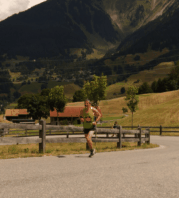
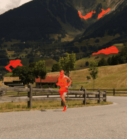
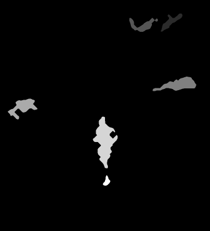
 

  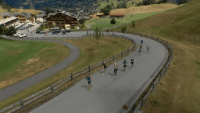
  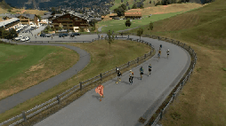
  

### How?

The first question is how the data can be processed. The basic work is done by a simple workflow on top of our Spark Image Layer. This abstracts away the complexities of cloud computing and distributed analysis. You focus only on the core task of image processing.

Beyond a single camera, our system scales linearly to multiple cameras and can distribute this computation across many computers to keep the computation real-time.

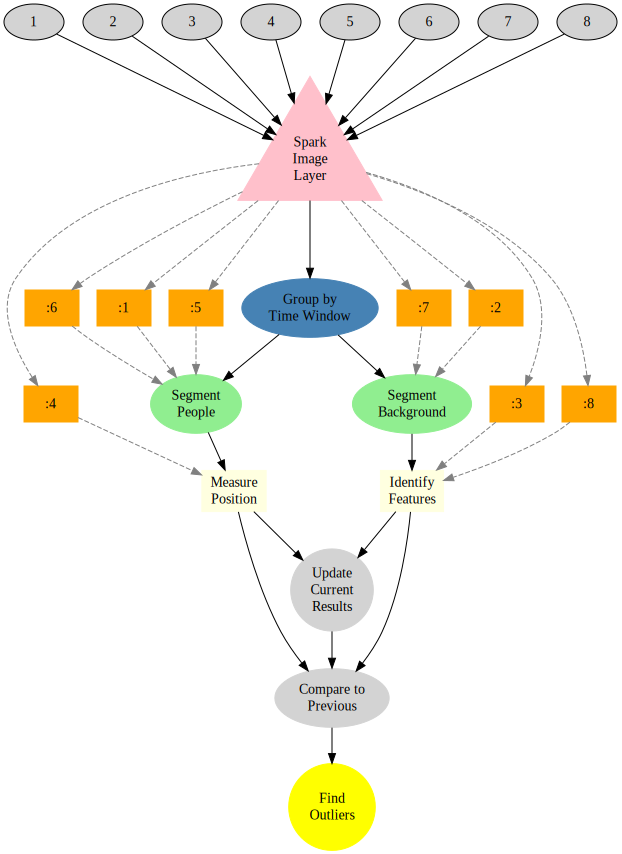

With cloud-integration and *Big Data*-based frameworks, even handling an entire city network with 100s of drones and cameras running continuously is an easy task without worrying about networks, topology, or fault-tolerance. Below is an example for 30 drones where the tasks are seamlessly, evenly divided among 50 different computers.

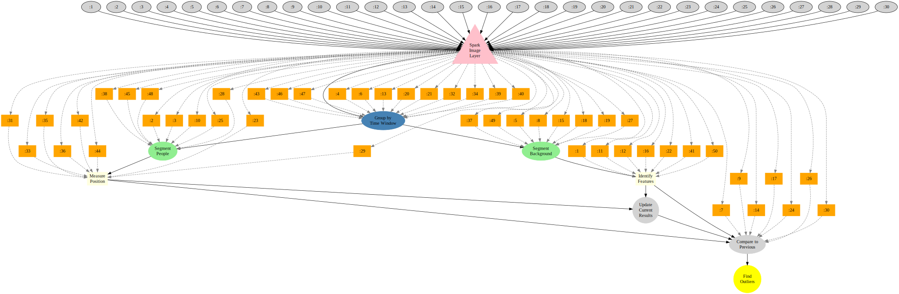

### What?

The images which are collected by the drones at rate of 30 frames per second contain substantial dynamic information on not only persons, but vehicles, buildings, and landscapes. The first basic task is the segmentation of the people which can provide information on their number, movement, and behavior

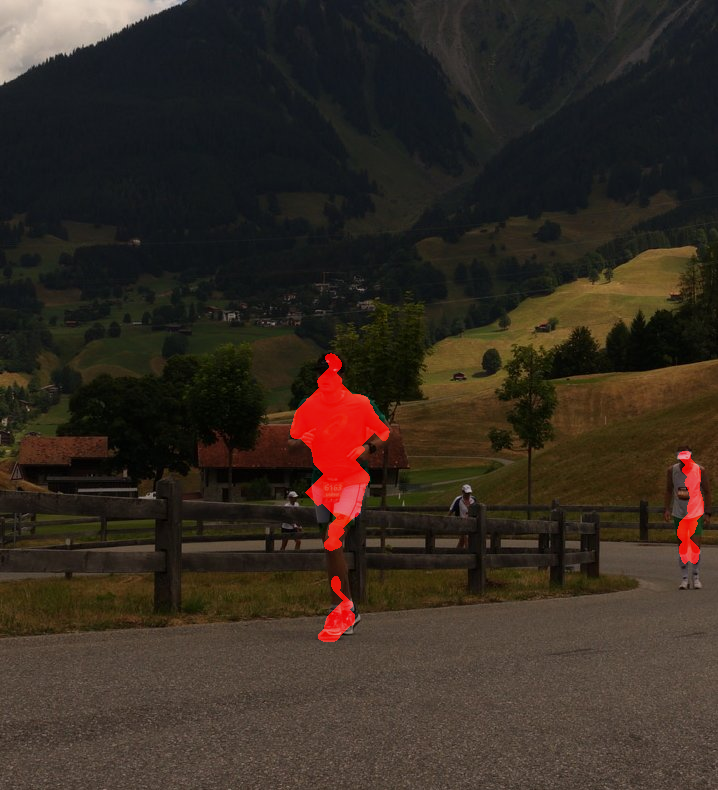

The segmented image above can be transformed into quantitative metrics at each time point. These metrics can then be processed to extract relevant quality assessment information for the tracks.

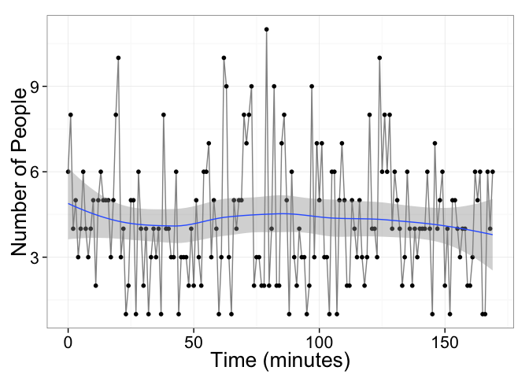

The data can then be broken down into small scenes where the number and flow of people in each grouping can be evaluated.

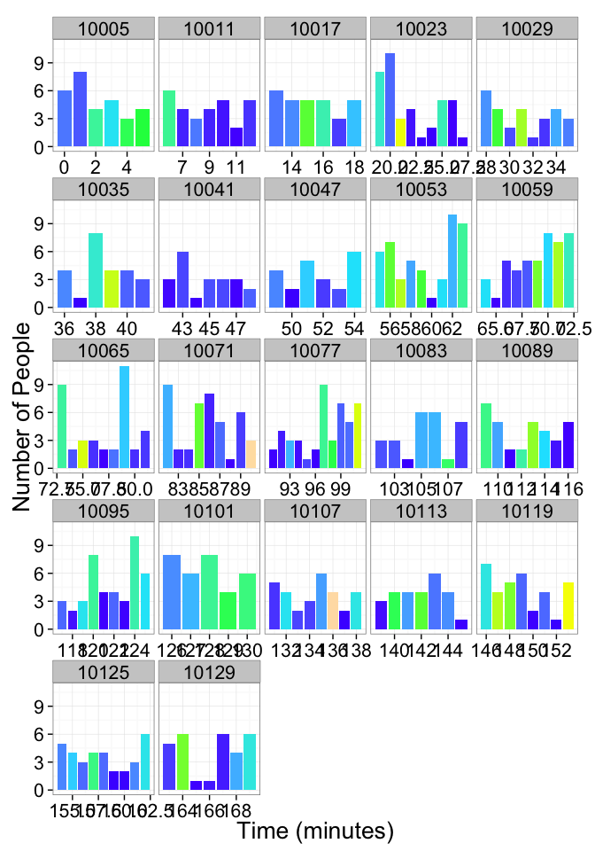

Dynamic information can be obtained by tracking the person objects (below) from one scene to the next. As seen in the image below, these are simply outlines and completely un-identifiable back to the original person. This alleviates many privacy and personal information concerns.

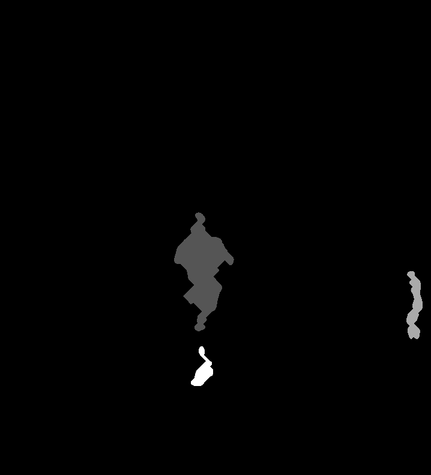
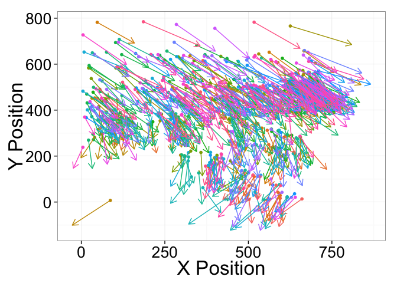

The data can also be smoothed to show more clearly trends and person counts on a single image.

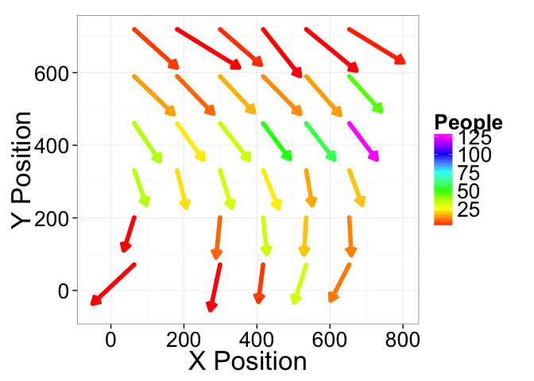

## Technical Aspects

### Streaming the Data

Once the cluster has been comissioned and you have the *StreamingSparkContext* called `ssc` (automatically provided in [Databricks Cloud](https://databricks.com/product/databricks-cloud) or [Zeppelin](http://zeppelin.incubator.apache.org/)), the data can be loaded using the Spark Image Layer. Since we are using real-time analysis, we acquire the images from a streaming source

  val droneCam1 = TrainCameraReceiver("https://drone-8092")  
  val droneCam2 = TrainCameraReceiver("https://drone-8093")  
  val metaImageStream = ssc.receiverStream(trainCam1 ++ trainCam2)

Although we execute the command on one machine, the analysis will be distributed over the entire set of cluster resources available to `ssc`. To further process the images, we can take advantage of the rich set of functionality built into Spark Image Layer

  def identifyPeople(time: Double, pos: GeoPos, inImage: Img[Byte]) = {  
    // Run the image processing steps on all images  
    val peopleOutlines = inImage.  
      window(3s).  
      run("Median...","radius=3"). // filter out the noise  
      run("Rolling Background Subtraction..."). // remove static objects  
      run("Threshold","OTSU") // threshold bright structures  
    val peopleShape = peopleOutlines.  
      morphology(CLOSE,5) // connect nearby objects  
      componentLabel(). // identify the components   
      filter(_.area>50). // take only the larger sized  
      shapeAnalysis() // analyze the position and shape  
    // return smoothness and separation based on the segmented image  
    PersonInformation(size=peopleShape.area)  
  }  
  // apply the operation to all images as they come in  
  val peopleStream = metaImageStream.map(identifyPeople)

The entire pipeline can then be started to run in real-time on all the new images as they stream in. If the tasks become more computationally intensive, then the computing power can be scaled up and down elastically.

## Learn More

To find out more about the technical aspects of our solution, check out our presentation at the [Spark Summit](http://4quant.com/spark-east-2015) or watch the [video](https://www.youtube.com/watch?v=ohR_y7HZaHA&index=10&list=PL-x35fyliRwiy50Ud2ltPx8_yA4H34ppJ).
Check out our other demos to see how 4Quant can help you:

* [Check train tracks in real time](http://4quant.com/Railway-Check)
* [Track criminals in cars using traffic cameras](http://4quant.com/Pursuing-Criminals/)
* [Find colon cancer with capsule endoscopy](http://4quant.com/Capsule-Endoscopy/)
* [Counting Cars in Satellite Images](http://4quant.com/countingcarsdemo)
* [Finding buildings and forests in Satellite Images](http://4quant.com/geospatialdemo/)
