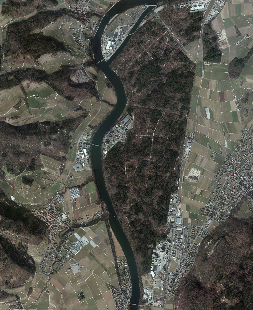
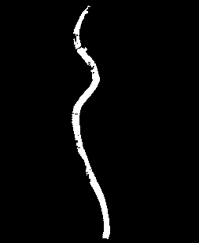
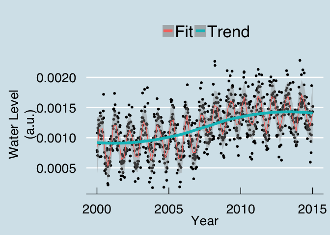
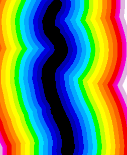
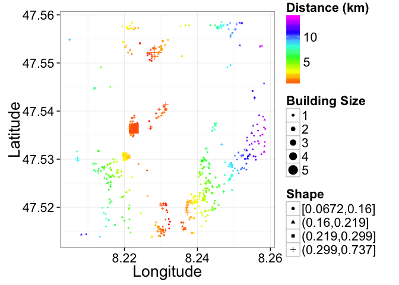

---

title: 'Flood Risk Analytics'

---

# Flood Risk Analytics

August 4, 2015

## Flood Risk Assessment

For insurance companies to accurately model flood risk, primarily two sources of information are needed. First is information about flood severity, which can be derived from current and historic water location (rivers, coastlines, lakes), stores (glaciers, snowmelt), and levels (topology). Second is an analysis of vulnerability, which is based on the properties within these regions.

Property insurance firms require the ability to combine such information about natural structures with high geographic resolution. Historic information is of limited value due to limited detail of existing records (in both a spatial and temporal sense) and the rarity of flood events. Additionally climate change causes local change in weather patterns and surface modifications lead to altering water run-off pathways.

Despite a multitude of data sources, there has been a drought in actionable information and as a result flood modeling has been both uncertain and ambiguous. The uncertainty and ambiguity has tremendous financial implications as in the year 2013 alone, water-hazard-related losses amounted to [nearly one trillion USD](http://www.munichre.com/).

For an evidence-based risk modeling to be a reality, it is essential to have access to high-resolution data collected over the entire area of insured properties on a regular basis. With this dynamic information, it would be possible to couple the models for distribution of the flood severity with the vulnerability of the insurance portfolio and arrive transparently at a concrete, traceable value for total loss prediction. The modeled information can further be used in various analytical areas of general insurance firms such as in pricing, reserving, and capital modeling for solvency purposes.

## Next Generation Satellite Imaging with IQAE

In parallel, the latest satellite developments from NASA, Google, Airbus Defense EADS and others provide frequent (weekly) high resolution (10m) imaging of the entire planet. These measurements result in petabytes of data generation.

### Image Query and Analysis Engine

Our tools enable large, complicated satellite imaging datasets to be processed easily and scaled across hundreds of machines.

### Example

#### Locate bodies of water in the image

Here we locate and segment the water for a single day in the following images.

  SELECT feature FROM (  
    SELECT SEGMENT_WATER(image.blue) FROM SatelliteImages   
    ) WHERE AREA > 1000m^2 AND DATE IS 4-8-2015

  
  

The data can also be processed over months even years worth of old images to characterize the standard changes in water levels.

  SELECT DATE,AREA FROM (  
    SELECT SEGMENT_WATER(image.blue) FROM SatelliteImages   
    ) WHERE AREA > 1000m^2 AND   
      DATE BETWEEN 4-8-2000 AND 4-8-2015

This information can then be summarized by year to get a better idea of the most extreme cases from a large pool

  SELECT DATE.YEAR,MIN(AREA),MAX(AREA) FROM (  
    SELECT SEGMENT_WATER(image.blue) FROM SatelliteImages   
    ) WHERE AREA > 1000m^2 AND   
      DATE BETWEEN 4-8-2000 AND 4-8-2015  
      GROUP BY DATE.YEAR  

<table class="styled-table">
  <thead>
    <tr>
      <th>year</th>
      <th>min.area</th>
      <th>max.area</th>
    </tr>
  </thead>
  <tbody>
    <tr>
      <td>2000</td>
      <td>0.0006822</td>
      <td>0.0017186</td>
    </tr>
    <tr class="even">
      <td>2001</td>
      <td>0.0002175</td>
      <td>0.0017342</td>
    </tr>
    <tr>
      <td>2002</td>
      <td>0.0003068</td>
      <td>0.0015424</td>
    </tr>
    <tr class="even">
      <td>2003</td>
      <td>0.0002740</td>
      <td>0.0018010</td>
    </tr>
    <tr>
      <td>2004</td>
      <td>0.0001725</td>
      <td>0.0018281</td>
    </tr>
    <tr class="even">
      <td>2005</td>
      <td>0.0001795</td>
      <td>0.0016319</td>
    </tr>
    <tr>
      <td>2006</td>
      <td>0.0001851</td>
      <td>0.0018769</td>
    </tr>
    <tr class="even">
      <td>2007</td>
      <td>0.0003189</td>
      <td>0.0019106</td>
    </tr>
    <tr>
      <td>2008</td>
      <td>0.0007270</td>
      <td>0.0022661</td>
    </tr>
    <tr class="even">
      <td>2009</td>
      <td>0.0006729</td>
      <td>0.0021103</td>
    </tr>
    <tr>
      <td>2010</td>
      <td>0.0007058</td>
      <td>0.0020922</td>
    </tr>
    <tr class="even">
      <td>2011</td>
      <td>0.0006443</td>
      <td>0.0021316</td>
    </tr>
    <tr>
      <td>2012</td>
      <td>0.0008001</td>
      <td>0.0020073</td>
    </tr>
    <tr class="even">
      <td>2013</td>
      <td>0.0006278</td>
      <td>0.0021103</td>
    </tr>
    <tr>
      <td>2014</td>
      <td>0.0008639</td>
      <td>0.0022816</td>
    </tr>
    <tr class="even">
      <td>2015</td>
      <td>0.0005949</td>
      <td>0.0018625</td>
    </tr>
  </tbody>
</table>

#### Identify houses in image

  SELECT feature FROM (  
    SELECT SEGMENT_BUILDING(image) FROM SatelliteImages   
    ) WHERE SIZE > 100m^2 AND DATE IS 4-8-2014  

  
  

#### Identify the houses distance from the river

SELECT bd.pos,rv.distance FROM Buildings AS bd JOIN Distance(River) AS rv ON bd.pos = rv.pos

  
  

Or an interactive map for more exact examination:

<iframe height="560px" width="560px" src="http://4quant.com/Flood-Risk/widget_building-distance.html"></iframe>

Furthermore the data can be analyzed using standard tools like Excel, R, or Matlab for further quantifying and modeling of the risk.

A more detailed distribution which allows us to see that the larger more expensive buildings (the category furthest on the right) are preferentially located close to the river. This could be a major concern for future risks.

## How

There are two interfaces available the *data consumer* and the *data scientist*.

* For the **data consumer** There interface is SQL console (JDBC-compatible), which can be examined with ad-hoc queries as shown above. The data can be combined and integrated with other sources using standard SQL operations and the full class of 4Quant’s imaging tools are available as integrated functions.
* For the **data scientist** There is a Scala/Java and Python interface. With this interface new code can be compiled and execute to process the images and other data. Anything from new image processing functions (denoising, feature recognition, optical character recognition) to further analyses (covariance matrix-based identification) can easily be integrated in our high-throughput pipeline.

### Distributing the Analysis

The first question is how the data can be processed. The basic work is done by a simple workflow on top of our Spark Image Layer. This abstracts away the complexities of cloud computing and distributed analysis. You focus only on the core task of image processing.

Beyond a single train, our system scales linearly to multiple datasources and petabytes of information across hundreds of computers to keep the computation real-time.

With cloud-integration and Big Data-based frameworks, even handling an entire satellite network with 100s of satellites continuously collecting data is an easy task without worrying about networks, topology, or fault-tolerance. Below is an example for 30 different map sources where the tasks are seamlessly, evenly divided among 50 different machines.

### Processing the Data

Once the cluster has been comissioned and you have the SparkContext called `sc` (automatically provided in [Databricks Cloud](https://databricks.com/product/databricks) or [Zeppelin](http://zeppelin.incubator.apache.org/), the data can be loaded using the Spark Image Layer. Since for this case we load the images from a private repository stored on Amazon’s S3 block storage (also compatible with local filesystems, Google Compute, IBM SoftLayer)

  val fullSatImage = sc.readTiledImage\[Double]("s3n://geo-images/esri-satimg/*/*.png",256,256).cache

Although we execute the command on one machine, the analysis will be distributed over the entire set of cluster resources available to `sc`. To further process the images, we can take advantage of the rich set of functionality built into Spark Image Layer. Watch [our webinar](https://www.youtube.com/watch?v=TA_h0jY7iPc) to learn more.

### Learn More

To find out more about the technical aspects of our solution, check out our presentation at the [Spark Summit](http://4quant.com/spark-east-2015) or watch the [video](https://www.youtube.com/watch?v=ohR_y7HZaHA&index=10&list=PL-x35fyliRwiy50Ud2ltPx8_yA4H34ppJ).
Check out our other demos to see how 4Quant can help you:

* [Counting Cars in Satellite Images](http://4quant.com/countingcarsdemo)
* [Finding buildings and forests in Satellite Images](http://4quant.com/geospatialdemo/)
* [Check train tracks in real time](http://4quant.com/Railway-Check)
* [Track criminals in cars using traffic cameras](http://4quant.com/Pursuing-Criminals/)
* [Count people from drone footage](http://4quant.com/Drone-People-Counting)

<!-- Strange text -->

<!-- ## Acknowledgements

  
Analysis powered by Spark Image Layer from 4Quant, Visualizations, Document Generation, and Maps provided by:

  
To cite ggplot2 in publications, please use:

  
H. Wickham. ggplot2: elegant graphics for data analysis. Springer New York, 2009.

  
A BibTeX entry for LaTeX users is

  

    @Book{, author = {Hadley Wickham}, title = {ggplot2: elegant graphics for data analysis}, publisher = {Springer New York}, year = {2009}, isbn = {978-0-387-98140-6}, url = {
    <a href="http://had.co.nz/ggplot2/book">http://had.co.nz/ggplot2/book</a>
  }, }
  

  
To cite package ‘leaflet’ in publications use:

  

    Joe Cheng and Yihui Xie (2014). leaflet: Create Interactive Web Maps with the JavaScript LeafLet Library. R package version 0.0.11.
    <a href="https://github.com/rstudio/leaflet">https://github.com/rstudio/leaflet</a>
  

  
A BibTeX entry for LaTeX users is

  

    @Manual{, title = {leaflet: Create Interactive Web Maps with the JavaScript LeafLet Library}, author = {Joe Cheng and Yihui Xie}, year = {2014}, note = {R package version 0.0.11}, url = {
    <a href="https://github.com/rstudio/leaflet">https://github.com/rstudio/leaflet</a>
  }, }
  

  
To cite plyr in publications use:

  

    Hadley Wickham (2011). The Split-Apply-Combine Strategy for Data Analysis. Journal of Statistical Software, 40(1), 1-29. URL
    <a href="http://www.jstatsoft.org/v40/i01/">http://www.jstatsoft.org/v40/i01/</a>
    .
  

  
A BibTeX entry for LaTeX users is

  

    @Article{, title = {The Split-Apply-Combine Strategy for Data Analysis}, author = {Hadley Wickham}, journal = {Journal of Statistical Software}, year = {2011}, volume = {40}, number = {1}, pages = {1–29}, url = {
    <a href="http://www.jstatsoft.org/v40/i01/">http://www.jstatsoft.org/v40/i01/</a>}
    , }
  

  
To cite the ‘knitr’ package in publications use:

  
Yihui Xie (2015). knitr: A General-Purpose Package for Dynamic Report Generation in R. R package version 1.10.

  
Yihui Xie (2013) Dynamic Documents with R and knitr. Chapman and Hall/CRC. ISBN 978-1482203530

  
Yihui Xie (2014) knitr: A Comprehensive Tool for Reproducible Research in R. In Victoria Stodden, Friedrich Leisch and Roger D. Peng, editors, Implementing Reproducible Computational Research. Chapman and Hall/CRC. ISBN 978-1466561595

  
To cite package ‘rmarkdown’ in publications use:

  

    JJ Allaire, Joe Cheng, Yihui Xie, Jonathan McPherson, Winston Chang, Jeff Allen, Hadley Wickham and Rob Hyndman (2015). rmarkdown: Dynamic Documents for R. R package version 0.7.
    <a href="http://CRAN.R-project.org/package=rmarkdown">http://CRAN.R-project.org/package=rmarkdown</a>
  

  
A BibTeX entry for LaTeX users is

  

    @Manual{, title = {rmarkdown: Dynamic Documents for R}, author = {JJ Allaire and Joe Cheng and Yihui Xie and Jonathan McPherson and Winston Chang and Jeff Allen and Hadley Wickham and Rob Hyndman}, year = {2015}, note = {R package version 0.7}, url = {
    <a href="http://CRAN.R-project.org/package=rmarkdown">http://CRAN.R-project.org/package=rmarkdown</a>
    }, }
  

  
To cite package ‘DiagrammeR’ in publications use:

  
Knut Sveidqvist, Mike Bostock, Chris Pettitt, Mike Daines, Andrei Kashcha and Richard Iannone (2015). DiagrammeR: Create Graph Diagrams and Flowcharts Using R. R package version 0.7.

  
A BibTeX entry for LaTeX users is

  
@Manual{, title = {DiagrammeR: Create Graph Diagrams and Flowcharts Using R}, author = {Knut Sveidqvist and Mike Bostock and Chris Pettitt and Mike Daines and Andrei Kashcha and Richard Iannone}, year = {2015}, note = {R package version 0.7}, }

 -->
