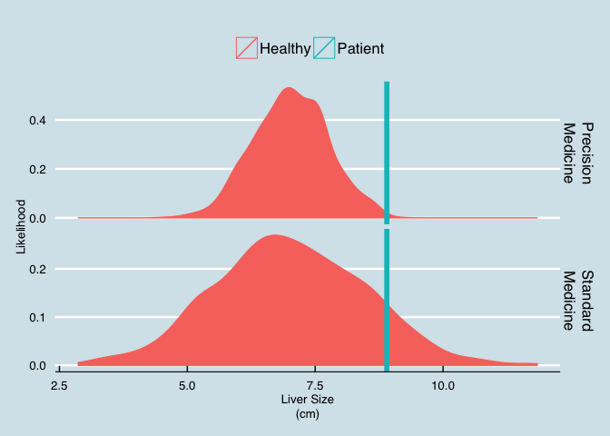
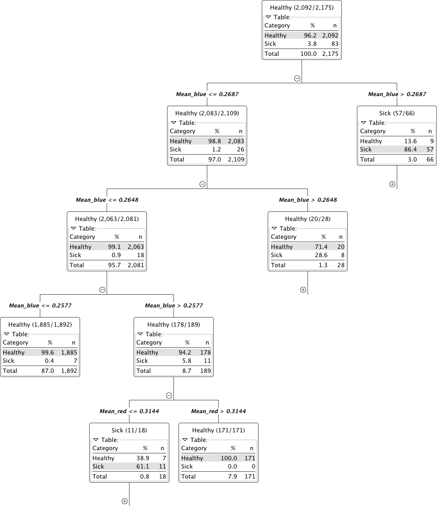
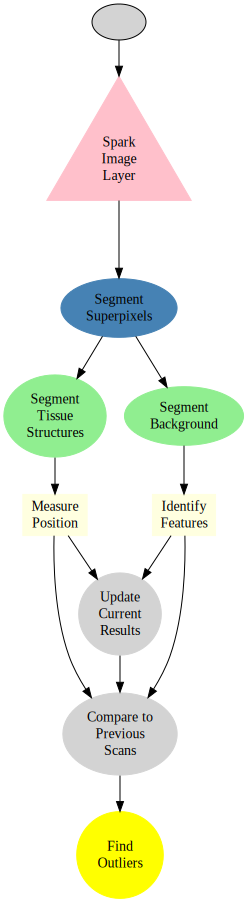

---

title: 'Indexing Medicine with Smart Image Databases'

---

# Indexing Medicine with Smart Image Databases

August 12, 2015

## Anomaly detection in patients is challenging because reference values are vague

Identifying patients with enlarged livers is important for identifying hepatitis, systemic disease, and even chronic conditions like alcohol abuse. *Oversized* is, however, a very poorly defined term. What is normal? Currently medicine operates on the basis of painstaking, time-consuming studies made from relatively homogenous populations. Using this ruler means many sick patients are not identified.

## Precision Medicine with *IQAE*

By combining large sets of information about patients together, finding outliers and treating patients can be much better matched to the individual background of that patients. Rather than comparing the patient to an old publication, they can be compared to a group matching their age, gender, and lifestyle.

The graph below shows the same patient with (left) and without (right) precision medicine.

* The *precision case* is **clear**, the patient’s liver is definitely larger than it should be.
* The *standard medicine* is **inconclusive**, a bit larger, but nothing definitive.

Despite recent boosts in popularity, both personalized and precision medicine are still not part of the standard diagnosis process for many diseases.

### *Image Query and Analysis Engine*

Standard imaging modalities like thorax CT and MRI are commonly used to diagnose a number of different diseases. These images are normally examined once for a single specific diagnosis and then archived. Hospitals are required to archive a majority of patient imaging studies and scans for a minimum of 10 years. These essential data are just sitting unused on PACS, tapes, and other storage volumes.

These archives of images contain exactly the sort of information required to make precision diagnoses, they are simply difficult to access.

**IQAE** is the key to unlocking the potential of this data and turning it from a burden into an asset. The data can be analyzed in a completely anonymized manner to obtain general, precise statistics as references against which to compare new patients. Additionally careful analysis of all data can reveal mistakes, missed diagnoses, and new potential high risk patients.

### Real-time Querying of Images

A hospital database with thousands of patient images can be quickly screening for the right type of images.

SELECT Image as ChestCT FROM PatientImages WHERE Modality="CT" AND Region="Chest"

### Perform Segmentation

SELECT CHEST_SEGMENTATION(Image) as ChestSeg FROM ChestCT

### To individual organs

### Extract the bones

SELECT BoneImage FROM ChestSeq

### Extract Meaningful Information

SELECT pt.Age,EstimateBoneMineralDensity(cs.BoneImage) as BMD 
  FROM PatientDatabase AS pt JOIN ChestSeq AS cs ON pt.id == cs.PatientId

### What else?

Our *Image Query and Analysis Engine* runs in the cloud or locally and is used as Software as a Service to ensure you are always working with the latest generation of algorithms and tools. Once the image data is inside the possibilities are endless.

SELECT * FROM ChestSeq GROUP BY Tissue.Type

| Organ | Subdivisions | Size | Density | Granularity | Contrast |
| --- | --- | --- | --- | --- | --- |
| Organ-1 | 330 | 19716 | 167.005424 | 5.236076 | 79.237187 |
| Organ-2 | 304 | 24070 | 114.700884 | 15.393268 | 114.506345 |
| Organ-3 | 1527 | 34052 | 108.518688 | 2.199077 | 38.206649 |
| Organ-4 | 923 | 45009 | 167.644877 | 5.812359 | 93.827160 |
| Organ-5 | 2241 | 420616 | 4.335617 | 3.901147 | 1.638404 |
| Organ-6 | 1249 | 111752 | 87.660901 | 5.682593 | 36.652440 |
| Organ-7 | 1810 | 42470 | 92.295132 | 2.201355 | 31.504958 |
| Organ-8 | 981 | 46241 | 98.798077 | 3.735183 | 36.448815 |
| Organ-9 | 1218 | 132143 | 87.141019 | 6.333512 | 36.699420 |
| Organ-10 | 1212 | 116776 | 102.505143 | 6.505061 | 46.829904 |
| Organ-11 | 1179 | 303374 | 167.225698 | 6.278122 | 41.896361 |
| Organ-12 | 995 | 264328 | 74.416866 | 6.585659 | 20.422562 |

From all of the images general trends can be identified by examining all of the phenotypes and trying to identify the important ones for differentiating disease. The following figure shows the relationship between shape (of the super-pixels) and the healthy segments as pink dots and the abnormal as blue dots. The shape and position provide some differentation but are not definitive enough to clearly distinguish the two groups.

Here we show the relative color components for each channel (red, green, and blue) and how they are related to the tissue labeled as healthy and abnormal.

Here rather than showing the relative intensities we show the median absolute deviation which is better at characterizing the variation inside each structure.

The results can also be summarized as statistical outputs for comparing the phenotypes values for the groups of normal and abnormal tissue.

### Machine Learning

The quantitatively meaningful data can then be used to train machine learning algorithms (decision trees to SVM) in order to automatically high-light many of the interesting regions and label them as such, dratistically reducing the required time to analyze a single patient.

Here we show a simple decision tree trained to identify lesions using color, position, texture and shape.

Furthermore the ability to parallelize and scale means thousands to millions of videos can be analyzed at the same time to learn even more about the structures of the digestive track and identify new possibilities for diagnosis.

### How?

The first question is how the data can be processed. The basic work is done by a simple workflow on top of our Spark Image Layer. This abstracts away the complexities of cloud computing and distributed analysis. You focus only on the core task of image processing.

The true value of such a scalable system is not in the single analysis, but in the ability to analyze hundreds, thousands, and even millions of samples at the same time.

With cloud-integration and *Big Data*-based frameworks, even handling an entire city network with 100s of drones and cameras running continuously is an easy task without worrying about networks, topology, or fault-tolerance.

## Technical Aspects

### Processing the Data

Once the cluster has been comissioned and you have the *SparkContext* called `sc` (automatically provided in [Databricks Cloud](https://databricks.com/product/databricks) or [Zeppelin](http://zeppelin.incubator.apache.org/)), the data can be loaded using the Spark Image Layer. Since we are using real-time analysis, we acquire the images from an archive of images and create a database out of the results.

val iqaeDB = sc.createImageDatabase("s3n://chest-ct/scans/*/*.avi",  
  patientInfo="jdbc://oracle-db/PATIENTS") 
  iqaeDB.registerImageTable("PatientImages") 

Although we execute the command on one machine, the analysis will be distributed over the entire set of cluster resources available to `sc`. To further process the images, we can take advantage of the rich set of functionality built into Spark Image Layer.

The entire pipeline can then be started to run in real-time on all the new images as they stream in. If the tasks become more computationally intensive, then the computing power can be scaled up and down elastically.

## Learn More

*4Quant* is active in a number of different areas from medicine to remote sensing. Our image processing framework (Spark Image Layer) and our query engine (*Image Query and Analysis Engine*) are widely adaptable to a number of different specific applications.

Check out our other use-cases to see how *4Quant* can help you

#### Medicine

* [Planning surgery and radiotherapy with real time segmentations](http://4quant.com/Realtime-MRI-Segmentation)
* [Segmenting organs from archived chest CT images](http://4quant.com/Organ-Segmentation/)
* [Finding lesions in Capsule Based Endoscopy](http://4quant.com/Capsule-Endoscopy)

#### Geographic Information Systems

* [Calculating Flood Risk for Insurance Companies](http://4quant.com/Flood-Risk)
* [Counting Cars in Satellite Images](http://4quant.com/countingcarsdemo)
* [Finding buildings and forests in Satellite Images](http://4quant.com/geospatialdemo/)

#### Surveillance

* [Count people from drone footage](http://4quant.com/Drone-People-Counting)
* [Finding criminals with traffic cameras](http://4quant.com/Pursuing-Criminals/)

#### Real-time QA

* [Check train tracks in real time](http://4quant.com/Railway-Check)

#### Fun

* [Untangling the flood of Online Dating](http://4quant.com/Online-Dating)
* [Quantitative Image Search Machine](http://kmader.shinyapps.io/SearchMachineDemo)

### Technical Presentations

To find out more about the technical aspects of our solution, check out our presentation at:

* [Spark Summit](http://4quant.com/spark-east-2015) or watch the [video](https://www.youtube.com/watch?v=ohR_y7HZaHA&index=10&list=PL-x35fyliRwiy50Ud2ltPx8_yA4H34ppJ).
* [Synchrotron Radiation Instruementation 2015](http://4quant.com/SRI2015)
* [ICTMS 2015](http://4quant.com/ICTMS2015)
* [LifeScienceForumBasel 2015](http://4quant.com/LSFB2015)
