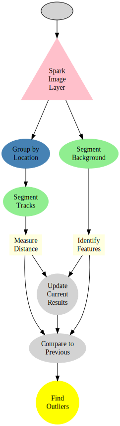
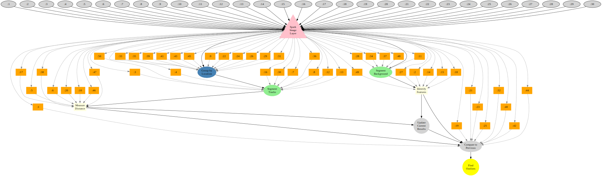

---

title: 'Train Video Analytics'

---

# Train Video Analytics

July 24, 2015

## Track Monitoring

Particularly in light of unusually warm weather [1](http://metro.co.uk/2011/06/27/train-delays-caused-by-rail-tracks-overheating-as-speed-limits-imposed-58022/), [2](http://www.railway-technology.com/features/featuretension-and-strain-on-overheated-trains/), [3](http://chicago.cbslocal.com/2012/07/19/cta-working-to-prevent-overheated-rails-other-heat-related-problems/), the risks of railway accidents has dramatically increased over the last years. Inspections using special trains are costly and infrequent (twice a week, [4](http://chicago.cbslocal.com/2012/07/18/union-pacific-railroad-concedes-misstatements-about-deadly-wreck/) ), while changes can happen over the course of a single day.

## Train-based Cameras

By mounting inexpensive portable imaging devices on each train, we can collect real-time image information on each of the tracks being crossed by processing the images using our Spark Image Layer.

  
  
  

## How?

The first question is how the data can be processed. The basic work is done by a simple workflow on top of our Spark Image Layer. This abstracts away the complexities of cloud computing and distributed analysis. You focus only on the core task of image processing.

Beyond a single train, our system scales linearly to multiple trains and computers to keep the computation real-time.

With cloud-integration and Big Data-based frameworks, even handling an entire train network with 100s of trains running continuously is an easy task without worrying about networks, topology, or fault-tolerance. Below is an example for 30 trains where the tasks are seamlessly, evenly divided among 50 different machines.

## What?

The images which fly past the train at hundreds of meters per second are rich in information about the tracks, structure, and even details to potential upcoming dangers. The first basic task is the segmentation of the tracks which can provide information on their separation, surface smoothness, and direction.

The segmented image above can be transformed into quantitative metrics at each time point. These metrics can then be processed to extract relevant quality assessment information for the tracks.

Each time point from the video is shown here as a point and line corresponding to the left and right tracks.

Distributions of the optically estimated track surface can then be made for each track over the course of the journey.

The distance between the two tracks can also be estimated over the entire journey.

The information from each camera can be displayed with position instead of time, and displayed visually using mapping APIs.

<iframe height="560px" width="560px" src="http://4quant.com/Railway-Check/widget_distmap.html"></iframe>

With many train-mounted cameras the entire network can then be analyzed in real-time, with interactive alerts showing directly on the route plan.

<iframe height="560px" width="560px" src="http://4quant.com/Railway-Check/widget_samap.html"></iframe>

## Technical Aspects

### Streaming the Data

Once the cluster has been comissioned and you have the StreamingSparkContext called `ssc` (automatically provided in [Databricks Cloud](https://databricks.com/product/databricks) or [Zeppelin](http://zeppelin.incubator.apache.org/), the data can be loaded using the Spark Image Layer. Since we are using real-time analysis, we acquire the images from a streaming source

  val trainCam1 = TrainCameraReceiver("sbb://train-3275")  
  val trainCam2 = TrainCameraReceiver("sbb://train-3187")  
  val metaImageStream = ssc.receiverStream(trainCam1 ++ trainCam2)

Although we execute the command on one machine, the analysis will be distributed over the entire set of cluster resources available to `ssc`. To further process the images, we can take advantage of the rich set of functionality built into Spark Image Layer

  def identifyTracks(time: Double, pos: GeoPos, inImage: Img[Byte]) = {  
    // Run the image processing steps on all images  
    val rawTrack = inImage.  
      run("Median...","radius=3"). // filter out the noise  
      run("Tubeness..."). // highlight tube-like structures (tracks)  
      run("Threshold","OTSU") // threshold bright structures  
    val trackShape = rawTrack.  
      componentLabel(). // identify the components of the track  
      filter(_.area>50). // take only the larger sized  
      shapeAnalysis() // analyze the position and shape  
    // return smoothness and separation based on the segmented image  
    TrackInformation(smoothness=rawTrack.smoothness(), separation=calcSep(trackShape))  
  }  
  // apply the operation to all images as they come in  
  val trackStream = metaImageStream.map(identifyTracks)

The detailed information with time, position and track data can then be compared to reference values to find changes and alert the user

  trackStream.foreachRDD{  
    trackStream =>  
      val changePoints = trackStream.  
        join(trackStandards).  
        filter{  
          case(newData,oldResults) => abs(oldResults-newData)>0.05  
        }.collect()  
        // update the map  
        updateMap(changePoints)  
        // send an alert  
        changePoints.map(  
          (newPt,_) =>  
            sendAlert(newPt.pos+" at "+newPt.time+" has changed by more then 5%")  
        )  
  }

The entire pipeline can then be started to run in real-time on all the new images as they stream in. If the tasks become more computationally intensive, then the computing power can be scaled up and down elastically.

<!-- Strange text -->

<!-- ## Acknowledgements

  
Analysis powered by Spark Image Layer from 4Quant, Visualizations, Document Generation, and Maps provided by:

  
To cite ggplot2 in publications, please use:

  
H. Wickham. ggplot2: elegant graphics for data analysis. Springer New York, 2009.

  
A BibTeX entry for LaTeX users is

  

    @Book{, author = {Hadley Wickham}, title = {ggplot2: elegant graphics for data analysis}, publisher = {Springer New York}, year = {2009}, isbn = {978-0-387-98140-6}, url = {
    <a href="http://had.co.nz/ggplot2/book">http://had.co.nz/ggplot2/book</a>
  }, }
  

  
To cite package ‘leaflet’ in publications use:

  

    Joe Cheng and Yihui Xie (2014). leaflet: Create Interactive Web Maps with the JavaScript LeafLet Library. R package version 0.0.11.
    <a href="https://github.com/rstudio/leaflet">https://github.com/rstudio/leaflet</a>
  

  
A BibTeX entry for LaTeX users is

  

    @Manual{, title = {leaflet: Create Interactive Web Maps with the JavaScript LeafLet Library}, author = {Joe Cheng and Yihui Xie}, year = {2014}, note = {R package version 0.0.11}, url = {
    <a href="https://github.com/rstudio/leaflet">https://github.com/rstudio/leaflet</a>
  }, }
  

  
To cite plyr in publications use:

  

    Hadley Wickham (2011). The Split-Apply-Combine Strategy for Data Analysis. Journal of Statistical Software, 40(1), 1-29. URL
    <a href="http://www.jstatsoft.org/v40/i01/">http://www.jstatsoft.org/v40/i01/</a>
    .
  

  
A BibTeX entry for LaTeX users is

  

    @Article{, title = {The Split-Apply-Combine Strategy for Data Analysis}, author = {Hadley Wickham}, journal = {Journal of Statistical Software}, year = {2011}, volume = {40}, number = {1}, pages = {1–29}, url = {
    <a href="http://www.jstatsoft.org/v40/i01/">http://www.jstatsoft.org/v40/i01/</a>}
    , }
  

  
To cite the ‘knitr’ package in publications use:

  
Yihui Xie (2015). knitr: A General-Purpose Package for Dynamic Report Generation in R. R package version 1.10.

  
Yihui Xie (2013) Dynamic Documents with R and knitr. Chapman and Hall/CRC. ISBN 978-1482203530

  
Yihui Xie (2014) knitr: A Comprehensive Tool for Reproducible Research in R. In Victoria Stodden, Friedrich Leisch and Roger D. Peng, editors, Implementing Reproducible Computational Research. Chapman and Hall/CRC. ISBN 978-1466561595

  
To cite package ‘rmarkdown’ in publications use:

  

    JJ Allaire, Joe Cheng, Yihui Xie, Jonathan McPherson, Winston Chang, Jeff Allen, Hadley Wickham and Rob Hyndman (2015). rmarkdown: Dynamic Documents for R. R package version 0.7.
    <a href="http://CRAN.R-project.org/package=rmarkdown">http://CRAN.R-project.org/package=rmarkdown</a>
  

  
A BibTeX entry for LaTeX users is

  

    @Manual{, title = {rmarkdown: Dynamic Documents for R}, author = {JJ Allaire and Joe Cheng and Yihui Xie and Jonathan McPherson and Winston Chang and Jeff Allen and Hadley Wickham and Rob Hyndman}, year = {2015}, note = {R package version 0.7}, url = {
    <a href="http://CRAN.R-project.org/package=rmarkdown">http://CRAN.R-project.org/package=rmarkdown</a>
    }, }
  

  
To cite package ‘DiagrammeR’ in publications use:

  
Knut Sveidqvist, Mike Bostock, Chris Pettitt, Mike Daines, Andrei Kashcha and Richard Iannone (2015). DiagrammeR: Create Graph Diagrams and Flowcharts Using R. R package version 0.7.

  
A BibTeX entry for LaTeX users is

  
@Manual{, title = {DiagrammeR: Create Graph Diagrams and Flowcharts Using R}, author = {Knut Sveidqvist and Mike Bostock and Chris Pettitt and Mike Daines and Andrei Kashcha and Richard Iannone}, year = {2015}, note = {R package version 0.7}, }

 -->
